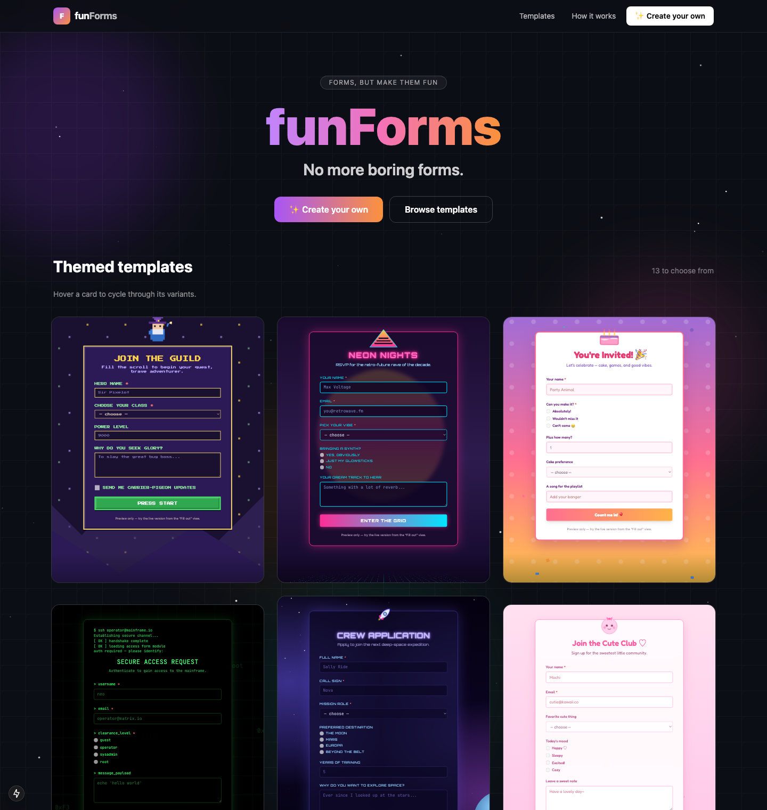

# funForms

**No more boring forms.** A Next.js form builder with 13 genuinely-themed,
animated templates — each with multiple variants — plus an AI-powered "create
your own" flow backed by the Claude API.



## Features

- **13 animated themes** — pixel arcade, hacker terminal, autumn, lab notebook,
  synthwave, cosmic, underwater, comic pop, winter, birthday, kawaii, wild west,
  and film noir. Each has its own signature animation.
- **Variants** — every theme ships 3 variants (different use-cases, same look).
  Hover a card on the home page to cycle through them.
- **Live builder** — edit a form's copy and fields with an instant preview.
- **AI generation** — describe an event or survey and Claude designs a themed
  form (fields, copy, and theme).

## Pages

| Route | What it is |
| --- | --- |
| `/` | Animated gallery of full, live template previews |
| `/create` | Pick a form type + describe it → Claude generates a themed form |
| `/builder/[id]` | Edit a template's copy and fields with a live preview |
| `/view/[id]` | Fill out the live form |

## Run with Docker Compose (recommended)

**Prerequisites:** Docker Desktop (or Docker Engine + Compose v2).

1. Create your env file from the sample and add your key:

   ```bash
   cp .env.sample .env
   # then edit .env and set ANTHROPIC_API_KEY=sk-ant-...
   ```

   > The key is **optional**. Without it the app still runs and the "Create your
   > own" flow falls back to a basic template instead of a Claude-designed one.

2. Build and start:

   ```bash
   docker compose up --build
   ```

3. Open **http://localhost:3000**.

To stop and remove the container:

```bash
docker compose down
```

## Run with Node (local dev)

```bash
npm install
cp .env.sample .env   # optional, for AI generation
npm run dev           # http://localhost:3000
```

## Configuration

| Variable | Required | Purpose |
| --- | --- | --- |
| `ANTHROPIC_API_KEY` | No | Enables AI form generation on `/create`. Falls back to a basic template if unset. |

## Notes

- State is **in-memory** (Zustand): edits and AI-generated forms live in the
  browser session and reset on a hard refresh.
- AI generation uses `claude-opus-5` via a strict tool call — see
  `src/app/api/generate/route.ts`.
- Built with Next.js (App Router), TypeScript, and Tailwind CSS.
